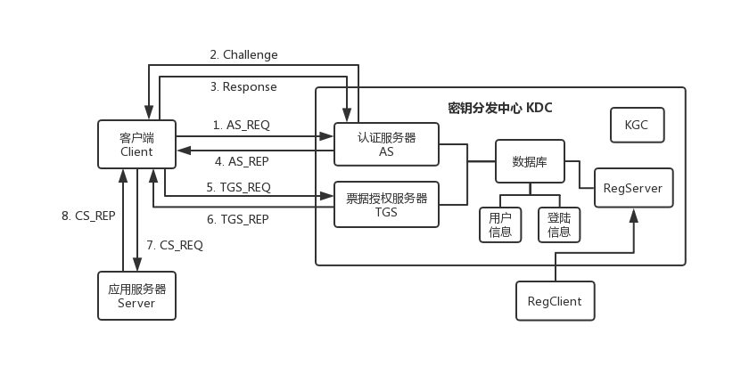

## Kerberos
基于 SM 国密算法改进的 Kerberos 身份认证系统。

系统依赖SM算法：[duanhongyi/gmssl](https://github.com/duanhongyi/gmssl)

### 系统架构图



**其中：**

1. AS_REQ = { timestamp } Kclt, UserA, nonce, iv

2. Challenge = challenge_msg

3. Response = { response_msg } hash

4. TGT = { UserA, Kclt-kdc } Kkdc

   AS_REP = TGT, { Kclt-kdc, timestamp, nonce } Kclt, iv

5. TGS_REQ = TGT, { UserA, timestamp } Kclt-kdc, ResourceB

6. Ticket = { UserA, Kclt-srv } Ksrv

   TGS_REP = { Kclt-srv } Kclt-kdc, Ticket

7. CS_REQ = { UserA, timestamp, nonce } Kclt-srv, Ticket, pub_key_a

8. CS_REP = { timestamp, nonce } Kclt-srv, pub_key_b

### 快速开始

1. 创建数据库：

   ```mysql
   CREATE DATABASE IF NOT EXISTS kerberos DEFAULT CHARACTER SET utf8;
   ```

2. 在 `conf/config.py` 下完成 MySQL 配置；

3. 运行 `console/migrate.py` 构建数据表；

4. 运行 `kerberos/register/RegServer.py` 和 `kerberos/register/RegClient.py` 完成认证双方的注册；

5. 依次启动 `kerberos/KDC.py`、`kerberos/ServerB.py`、`kerberos/ClientA.py` 模拟完整的身份认证过程。

### 端口服务

系统共包含 3 个服务：

- KDC 默认占用 9000 端口
- ServerB 默认占用 9001 端口
- RegServer 默认占用 9002 端口
